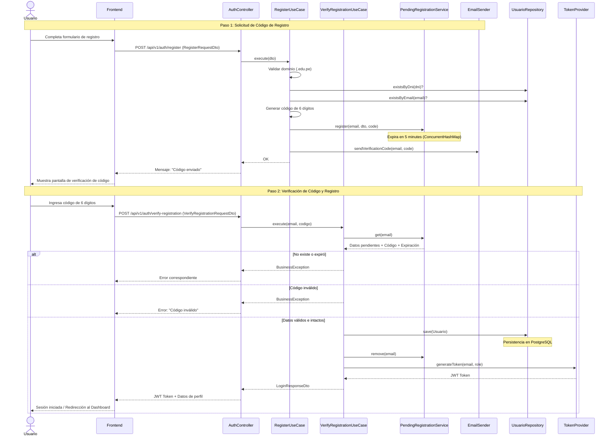
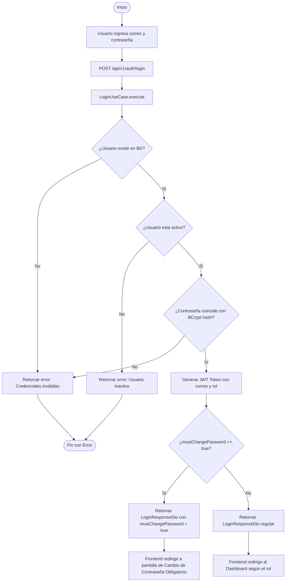

# Diagramas de Flujo y Procesos de Autenticación - SGI-FIIS

Este documento detalla visual y técnicamente los flujos de control del módulo de seguridad y usuarios del **Sistema de Gestión de Investigación (SGI-FIIS)**, describiendo detalladamente cómo interactúan los controladores, casos de uso, servicios en memoria, el servidor de correo y la persistencia de datos.

---

## 1. Flujo de Auto-registro (Self-Registration)

El auto-registro de estudiantes y tesistas se realiza en un proceso de **dos pasos** para asegurar la validez de la dirección de correo institucional antes de crear el usuario en la base de datos física del sistema.

### Paso 1: Solicitud de Código de Registro (`POST /api/v1/auth/register`)
1. El usuario completa sus datos personales en la interfaz del frontend.
2. El sistema valida que el correo ingresado termine con el dominio `.edu.pe`.
3. Se verifica que el **DNI** y el **correo** no existan ya registrados en la base de datos física.
4. Se genera un código aleatorio de 6 dígitos.
5. El DTO de registro y el código generado se guardan temporalmente en memoria (`PendingRegistrationService`) mediante una estructura `ConcurrentHashMap` con un tiempo de vida (expiración) de 5 minutos.
6. Se envía un correo electrónico al usuario conteniendo el código de verificación generado.

### Paso 2: Verificación de Código y Registro Final (`POST /api/v1/auth/verify-registration`)
1. El usuario ingresa el código de 6 dígitos recibido en su bandeja de entrada.
2. El backend busca el registro temporal en memoria mediante el correo del usuario.
3. Se valida que el registro temporal exista, no haya expirado y que el código ingresado coincida exactamente.
4. Si es válido, se cifra la contraseña del usuario mediante **BCrypt** y se persiste de manera definitiva en la base de datos PostgreSQL.
5. Se elimina el registro temporal en memoria para evitar re-utilizaciones.
6. Se genera un token **JWT** firmado y se retorna al cliente para que inicie sesión automáticamente.

---

## 2. Flujo de Inicio de Sesión (Login)

El inicio de sesión permite autenticar de forma local a usuarios previamente registrados mediante el flujo `/api/v1/auth/login`.

1. El backend recupera al usuario activo de la base de datos por su correo electrónico.
2. Compara la contraseña provista contra el hash almacenado en la base de datos utilizando el cifrado **BCrypt**.
3. Si el usuario tiene activo el indicador `mustChangePassword` (habitualmente tras un registro manual por parte del administrador o un reinicio de credenciales), la respuesta incluirá este campo en `true`.
4. El frontend redirigirá obligatoriamente al usuario a la pantalla de cambio de contraseña si `mustChangePassword` es `true`. En caso contrario, el usuario ingresa de forma regular a su respectivo Dashboard.

---

## 3. Gestión y Cambio de Contraseñas

Existen dos procesos de administración de credenciales locales: el **Cambio de contraseña voluntario/obligatorio** por parte del propio usuario, y el **Reinicio de contraseña** efectuado por un Administrador del sistema.

### Cambio de Contraseña (`POST /api/v1/auth/change-password`)
El usuario autenticado provee su contraseña actual y define una contraseña nueva. El sistema valida la contraseña actual, hashea la nueva contraseña y remueve la obligatoriedad de cambio de contraseña (`must_change_password = false`).

### Reinicio de Contraseña (`PATCH /api/v1/users/{id}/reset-password`)
El Administrador puede forzar el reinicio de las credenciales de cualquier cuenta de usuario. El sistema restablece la contraseña del usuario a su número de **DNI** por defecto y activa el indicador `must_change_password = true`, forzando al usuario a cambiarla en su siguiente acceso.

```mermaid
flowchart TD
    subgraph Reinicio por Administrador
        AdminStart([Admin inicia reinicio de contraseña]) --> AdminRequest["PATCH /api/v1/users/{id}/reset-password"]
        AdminRequest --> ReiniciarUseCase[ResetPasswordUseCase]
        ReiniciarUseCase --> ResetHash[Establecer hash de contraseña = DNI del usuario]
        ResetHash --> SetMustChange[Marcar must_change_password = true]
        SetMustChange --> SaveAdmin[Guardar en BD]
    end

    subgraph Cambio por Usuario
        UserStart([Usuario inicia cambio de contraseña]) --> UserRequest["POST /api/v1/auth/change-password"]
        UserRequest --> CambiarUseCase[ChangePasswordUseCase]
        CambiarUseCase --> CheckCurrent{¿Contraseña actual es correcta?}
        CheckCurrent -- No --> ErrorChange[Retornar error: Contraseña actual incorrecta]
        CheckCurrent -- Sí --> UpdateHash[Hashear nueva contraseña con BCrypt]
        UpdateHash --> ClearMustChange[Establecer must_change_password = false]
        ClearMustChange --> SaveUser[Guardar en BD]
    end
```

