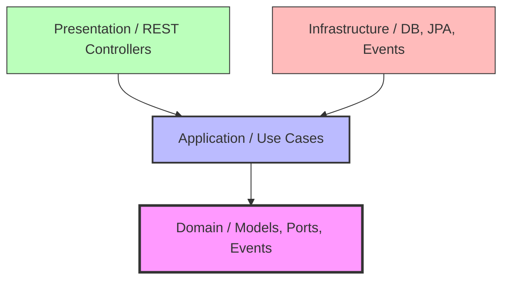

# Skill: Desarrollo con Arquitectura Limpia (Clean Architecture)

Esta guía define las reglas, estándares de codificación (Clean Code) y la estructura que debe seguirse rigurosamente al implementar cualquier funcionalidad en el **Sistema de Gestión de Investigación FIIS**.

---

## 1. Regla de Oro de Dependencias
Las dependencias apuntan **únicamente hacia adentro**. El núcleo (Dominio) no sabe nada de bases de datos, frameworks (Spring), ni de la web.



---

## 2. Estructura de Paquetes de un Módulo
Cada módulo del sistema (ej. `tramites`, `users`, `proyectos`) debe estructurarse de la siguiente manera:

```text
com.sgi.fiis.[modulo]
├── domain
│   ├── model          # Entidades puras y Value Objects (sin anotaciones JPA)
│   ├── port           # Interfaces que definen operaciones externas (Repository, Notification, etc.)
│   └── event          # Eventos de negocio (Domain Events)
├── application
│   ├── usecase        # Lógica de aplicación e implementación de flujos
│   └── dto            # DTOs de entrada (Request) y salida (Response)
├── infrastructure
│   ├── persistence    # Entidades JPA, repositorios Spring Data y adaptadores del Port de persistencia
│   └── event          # Adaptadores para mensajería o servicios externos
└── presentation
    ├── controller     # Controladores REST de Spring Boot
    └── mapper         # Mapeadores (mapstruct o manuales) para convertir entre capas
```

---

## 3. Patrones de Código por Capa (Ejemplos con Java)

### A. Capa de Dominio (Domain)
El dominio contiene las reglas de negocio. **No se permiten anotaciones de JPA (`@Entity`, `@Table`, `@Id`) ni de Spring (`@Component`, `@Autowired`) aquí.**

#### 1. Entidad de Dominio (`domain/model/Tramite.java`)
```java
package com.sgi.fiis.tramites.domain.model;

import lombok.AllArgsConstructor;
import lombok.Builder;
import lombok.Data;
import lombok.NoArgsConstructor;
import java.time.LocalDateTime;

@Data
@Builder
@NoArgsConstructor
@AllArgsConstructor
public class Tramite {
    private Long id;
    private String codigo;
    private String tipo;
    private String solicitanteEmail;
    private String estado;
    private String revisorRol;
    private String ultimaObservacion;
    private LocalDateTime fechaCreacion;
    private LocalDateTime fechaActualizacion;

    // Lógica de negocio (Regla de negocio)
    public void observar(String observacion, String rolRevisorSiguiente) {
        this.estado = "OBSERVADO";
        this.ultimaObservacion = observacion;
        this.revisorRol = rolRevisorSiguiente;
        this.fechaActualizacion = LocalDateTime.now();
    }
}
```

#### 2. Puerto de Persistencia (`domain/port/TramiteRepositoryPort.java`)
```java
package com.sgi.fiis.tramites.domain.port;

import com.sgi.fiis.tramites.domain.model.Tramite;
import java.util.Optional;
import java.util.List;

public interface TramiteRepositoryPort {
    Tramite save(Tramite tramite);
    Optional<Tramite> findById(Long id);
    Optional<Tramite> findByCodigo(String codigo);
    List<Tramite> findByGrupo(String grupoNombre);
}
```

---

### B. Capa de Aplicación (Application)
Contiene la orquestación del caso de uso. Puede usar `@Service` de Spring para que sea detectado como bean, o configurarse en una clase `@Configuration`.

#### 1. Caso de Uso (`application/usecase/ObservarTramiteUseCase.java`)
```java
package com.sgi.fiis.tramites.application.usecase;

import com.sgi.fiis.tramites.domain.model.Tramite;
import com.sgi.fiis.tramites.domain.port.TramiteRepositoryPort;
import org.springframework.stereotype.Service;
import org.springframework.transaction.annotation.Transactional;

@Service
public class ObservarTramiteUseCase {

    private final TramiteRepositoryPort repositoryPort;

    public ObservarTramiteUseCase(TramiteRepositoryPort repositoryPort) {
        this.repositoryPort = repositoryPort;
    }

    @Transactional
    public Tramite execute(Long tramiteId, String observacion, String rolRevisor) {
        Tramite tramite = repositoryPort.findById(tramiteId)
            .orElseThrow(() -> new IllegalArgumentException("Trámite no encontrado"));

        // Ejecuta la lógica del dominio
        tramite.observar(observacion, rolRevisor);

        // Guarda usando el puerto (abstracción)
        return repositoryPort.save(tramite);
    }
}
```

---

### C. Capa de Infraestructura (Infrastructure)
Aquí se implementa el acceso físico a los datos utilizando Spring Data JPA y Hibernate.

#### 1. Entidad JPA de Persistencia (`infrastructure/persistence/TramiteEntity.java`)
```java
package com.sgi.fiis.tramites.infrastructure.persistence;

import jakarta.persistence.*;
import lombok.Getter;
import lombok.Setter;
import java.time.LocalDateTime;

@Entity
@Table(name = "tramites")
@Getter
@Setter
public class TramiteEntity {
    @Id
    @GeneratedValue(strategy = GenerationType.IDENTITY)
    private Long id;

    @Column(nullable = false, unique = true)
    private String codigo;

    private String tipo;
    private String solicitanteEmail;
    private String estado;
    private String revisorRol;
    private String ultimaObservacion;
    private LocalDateTime fechaCreacion;
    private LocalDateTime fechaActualizacion;
}
```

#### 2. Repositorio de Spring Data (`infrastructure/persistence/SpringDataTramiteRepository.java`)
```java
package com.sgi.fiis.tramites.infrastructure.persistence;

import org.springframework.data.jpa.repository.JpaRepository;
import java.util.Optional;

public interface SpringDataTramiteRepository extends JpaRepository<TramiteEntity, Long> {
    Optional<TramiteEntity> findByCodigo(String codigo);
}
```

#### 3. Adaptador de Persistencia (`infrastructure/persistence/TramiteRepositoryAdapter.java`)
Este adaptador une el **Puerto del Dominio** con el **Repositorio de Spring Data**.
```java
package com.sgi.fiis.tramites.infrastructure.persistence;

import com.sgi.fiis.tramites.domain.model.Tramite;
import com.sgi.fiis.tramites.domain.port.TramiteRepositoryPort;
import com.sgi.fiis.tramites.presentation.mapper.TramiteMapper;
import org.springframework.stereotype.Component;
import java.util.Optional;
import java.util.List;
import java.util.stream.Collectors;

@Component
public class TramiteRepositoryAdapter implements TramiteRepositoryPort {

    private final SpringDataTramiteRepository springDataRepository;
    private final TramiteMapper mapper;

    public TramiteRepositoryAdapter(SpringDataTramiteRepository springDataRepository, TramiteMapper mapper) {
        this.springDataRepository = springDataRepository;
        this.mapper = mapper;
    }

    @Override
    public Tramite save(Tramite tramite) {
        TramiteEntity entity = mapper.toEntity(tramite);
        TramiteEntity savedEntity = springDataRepository.save(entity);
        return mapper.toDomain(savedEntity);
    }

    @Override
    public Optional<Tramite> findById(Long id) {
        return springDataRepository.findById(id).map(mapper::toDomain);
    }

    @Override
    public Optional<Tramite> findByCodigo(String codigo) {
        return springDataRepository.findByCodigo(codigo).map(mapper::toDomain);
    }

    @Override
    public List<Tramite> findByGrupo(String grupoNombre) {
        // Implementar consulta personalizada si es necesaria
        return List.of();
    }
}
```

---

### D. Capa de Presentación (Presentation)
Maneja la entrada/salida HTTP y serialización.

#### 1. Mapper de Capas (`presentation/mapper/TramiteMapper.java`)
Convierte objetos entre el dominio, DTOs y entidades de base de datos de manera limpia.
```java
package com.sgi.fiis.tramites.presentation.mapper;

import com.sgi.fiis.tramites.domain.model.Tramite;
import com.sgi.fiis.tramites.infrastructure.persistence.TramiteEntity;
import com.sgi.fiis.tramites.application.dto.TramiteResponseDto;
import org.springframework.stereotype.Component;

@Component
public class TramiteMapper {

    public TramiteEntity toEntity(Tramite domain) {
        if (domain == null) return null;
        TramiteEntity entity = new TramiteEntity();
        entity.setId(domain.getId());
        entity.setCodigo(domain.getCodigo());
        entity.setTipo(domain.getTipo());
        entity.setSolicitanteEmail(domain.getSolicitanteEmail());
        entity.setEstado(domain.getEstado());
        entity.setRevisorRol(domain.getRevisorRol());
        entity.setUltimaObservacion(domain.getUltimaObservacion());
        entity.setFechaCreacion(domain.getFechaCreacion());
        entity.setFechaActualizacion(domain.getFechaActualizacion());
        return entity;
    }

    public Tramite toDomain(TramiteEntity entity) {
        if (entity == null) return null;
        return Tramite.builder()
                .id(entity.getId())
                .codigo(entity.getCodigo())
                .tipo(entity.getTipo())
                .solicitanteEmail(entity.getSolicitanteEmail())
                .estado(entity.getEstado())
                .revisorRol(entity.getRevisorRol())
                .ultimaObservacion(entity.getUltimaObservacion())
                .fechaCreacion(entity.getFechaCreacion())
                .fechaActualizacion(entity.getFechaActualizacion())
                .build();
    }

    public TramiteResponseDto toResponseDto(Tramite domain) {
        if (domain == null) return null;
        return new TramiteResponseDto(
                domain.getId(),
                domain.getCodigo(),
                domain.getTipo(),
                domain.getEstado(),
                domain.getRevisorRol(),
                domain.getUltimaObservacion()
        );
    }
}
```

#### 2. Controlador REST (`presentation/controller/TramiteController.java`)
```java
package com.sgi.fiis.tramites.presentation.controller;

import com.sgi.fiis.tramites.application.usecase.ObservarTramiteUseCase;
import com.sgi.fiis.tramites.application.dto.TramiteResponseDto;
import com.sgi.fiis.tramites.domain.model.Tramite;
import com.sgi.fiis.tramites.presentation.mapper.TramiteMapper;
import org.springframework.http.ResponseEntity;
import org.springframework.web.bind.annotation.*;

@RestController
@RequestMapping("/api/v1/tramites")
public class TramiteController {

    private final ObservarTramiteUseCase observarUseCase;
    private final TramiteMapper mapper;

    public TramiteController(ObservarTramiteUseCase observarUseCase, TramiteMapper mapper) {
        this.observarUseCase = observarUseCase;
        this.mapper = mapper;
    }

    @PostMapping("/{id}/observar")
    public ResponseEntity<TramiteResponseDto> observarTramite(
            @PathVariable Long id,
            @RequestParam String observacion,
            @RequestParam String siguienteRevisor
    ) {
        Tramite updated = observarUseCase.execute(id, observacion, siguienteRevisor);
        return ResponseEntity.ok(mapper.toResponseDto(updated));
    }
}
```

---

## 4. Flujo de Trabajo para implementar una nueva funcionalidad
Al desarrollar, sigue estrictamente este orden de capas (de adentro hacia afuera):

1. **Definir el Dominio (Domain)**:
   - Escribe el modelo de negocio en `domain/model/`.
   - Define el puerto en `domain/port/` (ej. repositorio o interfaz de servicio externo).
2. **Definir la Aplicación (Application)**:
   - Crea los DTOs en `application/dto/`.
   - Implementa los casos de uso (`UseCase`) en `application/usecase/` utilizando los puertos definidos.
3. **Definir la Infraestructura (Infrastructure)**:
   - Crea la entidad JPA y el repositorio de Spring Data en `infrastructure/persistence/`.
   - Implementa el adaptador del puerto en `infrastructure/persistence/` conectando Spring Data JPA con la interfaz del puerto.
4. **Definir la Presentación (Presentation)**:
   - Escribe el Mapper de mapeo de objetos en `presentation/mapper/`.
   - Escribe el Controlador REST de Spring en `presentation/controller/`.
5. **Escribir Pruebas**:
   - Escribe pruebas unitarias del dominio y de los casos de uso.
   - Escribe pruebas de integración para la persistencia e inyección en Spring Boot.
